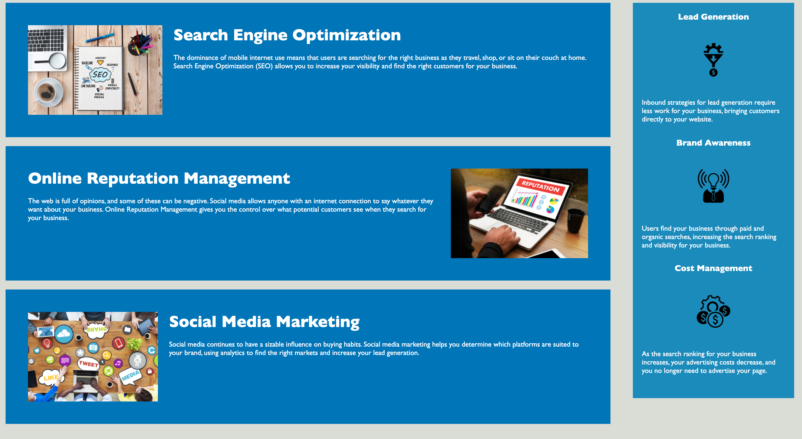

# Code Refactor Starter Code

https://dsamuelson.github.io/Horiseon-landing-page/#social-media-marketing

Changed the non-semantic div element in the header to the "header" element

Adjusted the div element for navigation to "nav"

adjusted the informational section which included an image, headline, and paragraph into an "article" element

Adjusted the different div elements for the informational sections of the websites into the "section" element

Combined lead brand cost sections in CSS into "lbc" to save on formatting space and relabled them accordingly

combined the search engine optimization, the Online Reputation Management, and the Social Media Marketing styles all into "search-engine-optimization" (the main idea in the section) to save on formatting space and changed the lables accordingly

adjusted indentation in the index.html to make it easier to see which elements were nested within which elements

adjusted the sections of the CSS styles sheet so that the info section is styled prior to the benefits section which follows the loading scheme

added section labels in comments in the index

made the links in the nav bar work for the articles in the info section

depending on the zoom there is a change in the alignment of the bottom sections which could explain any difference for this from the mockup

The following screenshot is of the page base under a 80% zoom:

